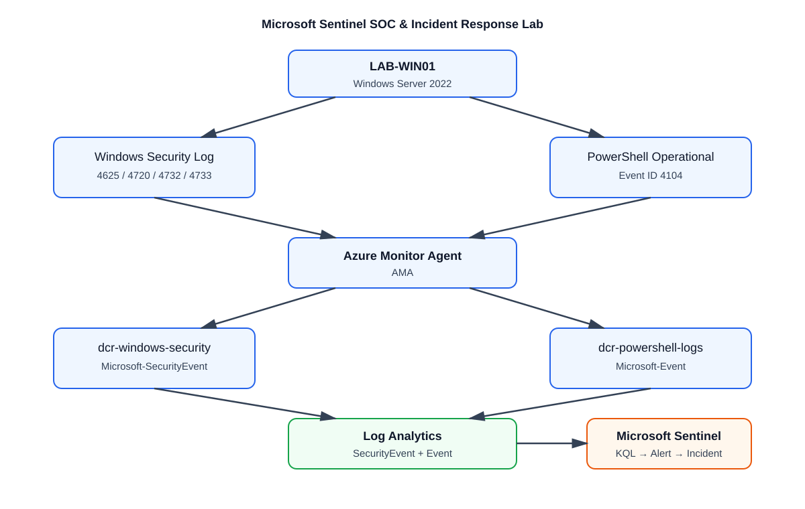

# Microsoft Sentinel SOC & Incident Response Lab

## Overview

A hands-on SOC portfolio project demonstrating Windows telemetry collection, KQL detection engineering, Microsoft Sentinel scheduled analytics rules, alert and incident investigation, automation, and MITRE ATT&CK mapping.

**All five original Project 1 scenarios are complete.** Controlled, authorized activity on `LAB-WIN01` was used to validate detection behavior. Lab cases are classified **True Positive — Benign / Authorized Simulation**.

## Lab architecture



```text
LAB-WIN01
  ├─ Windows Security log → AMA → dcr-windows-security → SecurityEvent
  └─ PowerShell Operational log → AMA → dcr-powershell-logs → Event
                                      ↓
                         Log Analytics: law-soc-lab
                                      ↓
                    Microsoft Sentinel KQL / scheduled rules
                                      ↓
                         SecurityAlert → SecurityIncident
```

**Environment:** Windows Server 2022 Datacenter Server Core, resource group `rg-soc-lab`, workspace `law-soc-lab`, Azure Monitor Agent and two Data Collection Rules. See [architecture details](architecture/architecture.md).

## Verified telemetry

- **Windows Security → SecurityEvent:** 4624 (successful logon), 4625 (failed logon), **4688 (process creation with command-line ingestion verified)**, 4720 (account created), 4722 (account enabled), 4724 (password reset attempt), 4725 (account disabled), 4732 (local group member added), and 4733 (local group member removed).
- **PowerShell Operational → Event:** 4104 Script Block Logging, collected through `dcr-powershell-logs` / `Microsoft-Event`. `RenderedDescription` supplies script content.
- Windows Security uses `dcr-windows-security` / `Microsoft-SecurityEvent`.

## Completed detection scenarios

| Scenario | Detection and validation | Investigation |
|---|---|---|
| 1 — Repeated failed Windows logons | [KQL](detections/failed-logon-detection.kql): five or more 4625 events in 15 minutes, grouped by account, host and IP. Controlled failures reached the threshold; historical alert records were observed. | [INC-001](incidents/INC-001-failed-logon-investigation.md) |
| 2 — Suspicious PowerShell Base64 decoding | [KQL](detections/suspicious-powershell.kql): 4104 script content containing `FromBase64String`. Benign `SOC-LAB-DAY4` marker; Medium scheduled rule; fresh alert and incident validated. | [INC-002](incidents/INC-002-powershell-investigation.md) |
| 3 — Failed logons followed by PowerShell | [KQL](detections/multi-stage-logon-powershell-correlation.kql): join 4625 and 4104 on host; PowerShell follows within 15 minutes. High scheduled rule, 5-minute frequency / 30-minute lookback; fresh alert and incident validated. | [INC-003](incidents/INC-003-multi-stage-correlation.md) |
| 4 — New local account added to Administrators | [KQL](detections/privileged-account-correlation.kql): join creation `TargetSid` to group-add `MemberSid`; Administrators SID `S-1-5-32-544`; addition within 15 minutes. High enabled rule, 5-minute frequency / 30-minute lookback; alert and incident evidence plus a separate fresh telemetry run. | [INC-004](incidents/INC-004-privileged-account-investigation.md) |
| 5 — Suspicious certutil decode process | [KQL](detections/suspicious-process-detection.kql): populated 4688 command line, certutil and decode conditions. Safe local text-file simulation; enabled Medium scheduled rule, 5-minute frequency / 15-minute lookback; fresh matching alert and same-title incidents validated. | [INC-005](incidents/INC-005-suspicious-process-investigation.md) |

**Scenario 5:** The 2026-09-13 21:39:58 UTC simulation encoded and decoded only benign local text files; hash verification returned True. No download, executable payload, persistence or security-control bypass occurred. Endpoint record 15852 and fresh `SecurityEvent` telemetry show the captured decode command and PowerShell parent. The rule verification displays the full stored 15-minute KQL and `GreaterThan 0` with incident creation enabled. The incident report distinguishes the earlier cmd.exe-parent event and the separate alert/incident examples; direct linkage between the displayed alert and selected incident 55 is not inferred.

Day 7 evidence: [simulation](screenshots/day7-certutil-safe-simulation.png) · [4688 ingestion](screenshots/day7-4688-certutil-ingestion.png) · [fresh telemetry](screenshots/day7-fresh-certutil-telemetry.png) · [manual KQL](screenshots/day7-suspicious-process-detection-kql.png) · [deployed rule](screenshots/day7-suspicious-process-rule-verified-cloudshell.png) · [alert](screenshots/day7-suspicious-process-security-alert.png) · [incident](screenshots/day7-suspicious-process-security-incident.png).

**Scenario 4 evidence limit:** The displayed 04:22 UTC alert/incident predate the second account's 04:44/04:45 UTC events. They validate the rule outputs separately, without proving those outputs came from `soclab-tempadmin2`. See the [evidence inventory](screenshots/EVIDENCE_INVENTORY.md) for every screenshot, stage and limitation.

## Detection engineering lessons

- **Temporal correlation:** Join `SecurityEvent` authentication and `Event` PowerShell activity by `Computer`, then constrain the sequence in time.
- **SID correlation:** Event 4732 recorded `MemberName` as unresolved while preserving `MemberSid`; matching it to creation `TargetSid` avoids reliance on display names.
- **Separate telemetry streams:** PowerShell 4104 supplies script content, while SecurityEvent 4688 supplies verified process/command-line context. Early PowerShell investigation pivoted to 4104; Day 7 completed 4688 validation.
- **Evidence discipline:** Distinguish manual hunting queries from deployed rules, captured record timestamps from ingestion latency, and named outputs from directly verified alert-ID linkage.

MITRE ATT&CK mappings: Credential Access / T1110 / T1110.001 (Scenario 1); Execution / T1059 / T1059.001 (Scenario 2); both for Scenario 3; configured Privilege Escalation / T1098 (Scenario 4); Defense Evasion / T1140 (Scenario 5). Behavioral mappings do not imply malicious intent in these authorized simulations.

## Automation and response workflow

[Telemetry health check](automation/validate-sentinel-telemetry.ps1) queries recent Windows Security and PowerShell 4104 ingestion from `LAB-WIN01`.

```text
Controlled activity → endpoint telemetry → Log Analytics → verified KQL
→ scheduled analytics → alert/incident validation → investigation
→ MITRE ATT&CK mapping → classification and documentation
```

## Repository contents

- [Architecture](architecture/architecture.md) and SVG diagram
- Five detection files in `detections/`
- Five completed case studies in `incidents/`
- [Screenshot inventory](screenshots/EVIDENCE_INVENTORY.md), including Days 4–7
- [PowerShell telemetry validation](automation/validate-sentinel-telemetry.ps1)

## Project status

- [x] Windows Security and PowerShell telemetry collection
- [x] Repeated failed-logon detection and investigation
- [x] Suspicious PowerShell rule, alert, incident and investigation
- [x] Multi-stage correlation rule, alert, incident and investigation
- [x] SID-based privileged-account rule, alert, incident and investigation
- [x] Safe suspicious-process simulation and Event ID 4688 validation
- [x] Suspicious-process Sentinel rule, alert, incident, screenshots, and investigation report
- [x] Five original detection scenarios and five incident reports complete
- [x] Architecture, MITRE ATT&CK mapping and evidence inventory
- [x] Telemetry validation automation

## Optional extensions

Additional reproducibility and automation hardening, production tuning, and expanded alert-to-incident linkage captures are optional improvements beyond the completed original scope.
